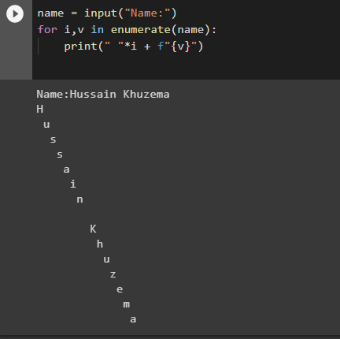
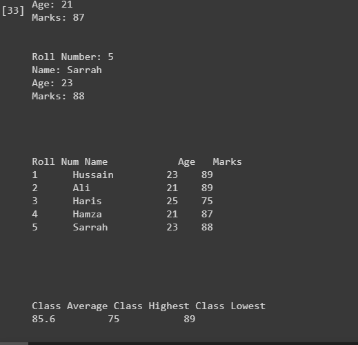

# DSC-DSU | Python Bootcamp 2020 | Week 1
Q1) Define a function to print a string diagonally,

.png)

Q2) Create a program to take as input 5 student records in the following format:
**roll_num** | **name** | **age** | **marks**(out of 100)
And then output the records in a tabular form with class average, class highest and class lowest at end in the following format.

Use dictionaries (list of dictionaries in exact)
Insert atleast 5 records
Input must be user-given
(Optional) validate the user input, i.e marks aren't greater 100 and other such validations you think there might be

Q3) A function that will print lyrics of given song with 1 second delay between each line.

Use time.sleep()
Use split() function of string

